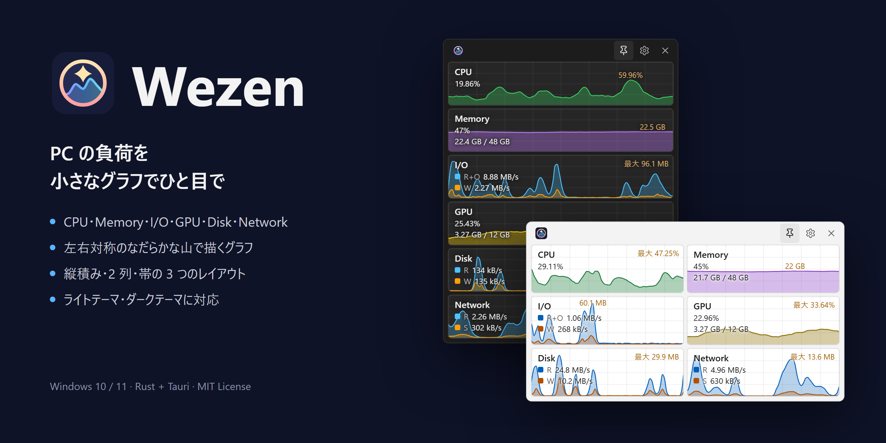

Wezen は、Windows のリソースの使用状況を小さなグラフで表示するアプリです。

- CPU、Memory、I/O、GPU、Disk、Network の 6 項目を表示します
- グラフの上に、今の値を重ねて表示します
- 縦積み、2 列、帯の 3 つのレイアウトから選べます
- グラフは前後の値でならし、左右対称のなだらかな山で描きます

## ドキュメント

- [使い方](docs/usage.md)
- [ビルドとリリース](docs/building.md)

## ライセンス

[MIT License](LICENSE)
